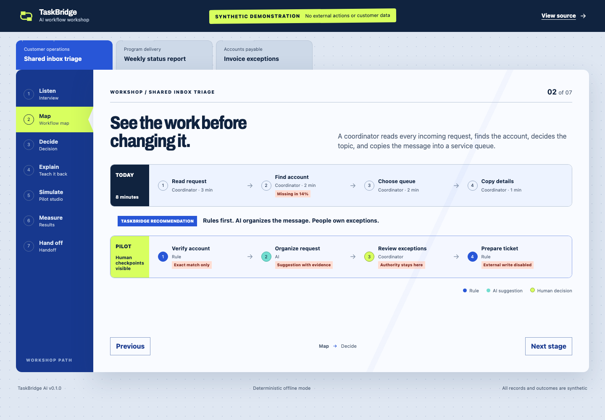
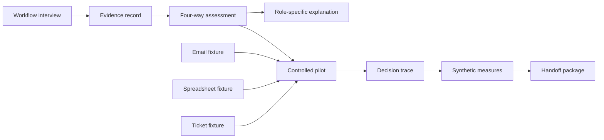

# TaskBridge AI

**Understand the work before choosing the technology.**

TaskBridge is an open-source workflow workshop for teams that want to improve repetitive work without assuming AI is always the answer. It captures how a task actually works, compares four intervention choices, simulates a controlled pilot, and explains the proposal to the people who perform, manage, approve, and secure the process.

> Every person, organization, record, measurement, and outcome in this repository is synthetic.



[Open the interactive demonstration](https://jermaine-anugwom.github.io/taskbridge-ai/)

## The everyday work problem

Small operational tasks accumulate quietly: reading a shared inbox, rebuilding a weekly report, comparing the same invoice fields, or moving information between systems. Teams often jump from that frustration directly to a tool decision.

TaskBridge inserts the missing step. It listens to the people doing the work, maps the current process, identifies uncertainty and failure cost, and compares:

1. Deterministic automation
2. AI assistance
3. A hybrid workflow
4. Leaving the process unchanged

The recommendation remains connected to the captured evidence, including volume, touch time, input structure, rule stability, reversibility, sensitivity, and error consequence.

## What the workshop includes

- A guided workflow interview
- Current-state and proposed-pilot maps
- Explainable intervention scoring
- Visible human checkpoints
- Role-specific “Teach It Back” explanations
- A deterministic pilot simulator
- A model-backed analysis path with structured tool calls
- Versioned prompts, evidence checks, retries, fallback, latency, token, and cost traces
- Role-gated APIs and SQLite or PostgreSQL persistence
- Synthetic baseline and pilot measurements
- A handoff package containing the charter, SOP, measures, risks, rollback plan, and training guide

The same underlying facts are used for employees, managers, executives, and IT or security. Only the language and emphasis change.

## Demonstration scenarios

| Scenario | Recommendation | Why |
|---|---|---|
| Shared-inbox triage | Hybrid workflow | Stable account checks, variable language, and consequential exceptions |
| Weekly status reporting | AI assistance | Language-heavy, reversible drafting with source-owner review |
| Invoice exceptions | Deterministic automation | Structured fields and stable tolerances do not need a model |

The invoice scenario is deliberately important: TaskBridge can conclude that adding AI would make a workflow less predictable without improving it.

## Architecture



- `src/taskbridge/` contains the FastAPI service, schemas, decision engine, simulator, persistence, and model-provider boundary.
- `web/` contains the Next.js workshop and credential-free static demonstration.
- `fixtures/` contains 120 synthetic records across email, spreadsheet, and ticket-queue adapters.
- `tests/` covers assessment modes, evidence, security boundaries, simulations, persistence, and API behavior.

## Quickstart

### One command

```bash
docker compose up --build
```

Open the workshop at `http://127.0.0.1:3000` and the API documentation at `http://127.0.0.1:8000/docs`.

### Python service

```bash
python3.12 -m venv .venv
source .venv/bin/activate
python -m pip install -c constraints.txt -e '.[dev]'
pytest -q
taskbridge
```

### Workshop interface

```bash
cd web
npm install
npm run dev
```

No API key, model account, or network connection is required after dependencies are installed.

## Model-backed operations mode

The deterministic engine remains the credential-free default and the source of the committed demonstration results. An optional OpenAI-compatible endpoint can analyze captured workflow evidence through the `record_workflow_analysis` tool contract.

The runtime:

- Forces a Pydantic-generated schema for model output.
- Requires every observation and proposed tool call to cite captured evidence IDs.
- Rejects unknown evidence, unsupported numbers, and actions that do not require approval.
- Retries transient provider failures and falls back to a deterministic human-review result.
- Records provider, model, prompt version, prompt hash, schema version, latency, retries, tokens, and cost when published rates are configured.
- Stores no API keys or bearer tokens in trace records.

The public Pages demonstration replays clearly labeled synthetic traces. It does not call a paid endpoint. See [Model operations](docs/MODEL_OPERATIONS.md) for the request contract and [`.env.example`](.env.example) for local configuration.

## Deployment controls

Local runs use SQLite by default. Docker Compose starts PostgreSQL, the API, and the static workshop. Production mode can require SHA-256-digested viewer, operator, and administrator bearer tokens. Raw tokens stay outside configuration files and trace records.

`POST /api/workflows/{id}/model-analysis` is operator-only when authentication is required. `GET /api/operations/model-traces` is available to viewers and returns the evidence-safe trace ledger.

## Safety and privacy boundaries

- Uploaded and imported text is treated as untrusted input.
- Prompt-injection patterns are quarantined before assessment.
- Unknown values remain unknown.
- Recommendations and explanations retain evidence identifiers.
- External writes are disabled in the demonstration.
- Synthetic pilot results are never presented as forecasts or customer outcomes.
- A live implementation would require representative data, employee observation, policy review, privacy review, security testing, and a monitored rollout.

See [SECURITY.md](SECURITY.md) for the full boundary and [FIELD_NOTES.md](FIELD_NOTES.md) for the discovery and handoff method.

## Measuring a pilot

TaskBridge records touch time, exceptions, human reviews, unsupported decisions, and override reasons. Fixture comparisons fail closed when evidence is missing. A real pilot should expand only when observed workflow results improve and the people doing the work trust the new process.

## Limitations and future integrations

Version `0.2.0` uses synthetic adapters and does not connect to email, finance, ticketing, or identity systems. It does not execute external actions. Future connectors should be added individually with least-privilege access, an explicit approval boundary, idempotency, retention rules, and integration-specific tests.

## Design and implementation decisions

Jermaine defined the workflow-first product direction, the four-way intervention decision, the employee-facing explanation model, and the requirement that model use remain optional. He also set the evidence, approval, simulation, and public-data boundaries used throughout the service and workshop.

## Project documents

- [Product context](PRODUCT.md)
- [Design system](DESIGN.md)
- [Field discovery and handoff](FIELD_NOTES.md)
- [Security boundaries](SECURITY.md)
- [Operating runbook](RUNBOOK.md)
- [Development record](DEVELOPMENT.md)
- [Architecture decisions](docs/ARCHITECTURE.md)
- [Model operations](docs/MODEL_OPERATIONS.md)
- [Release history](CHANGELOG.md)

## License

[MIT](LICENSE)
