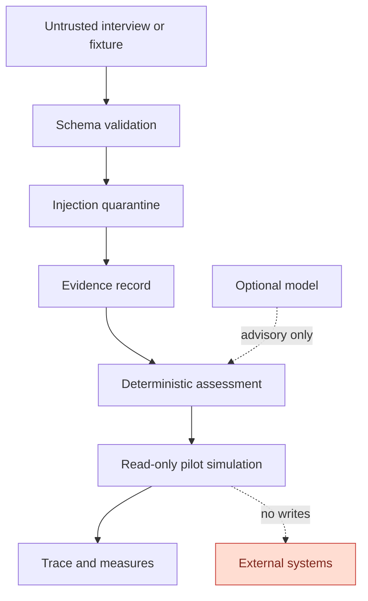

# Architecture

## Data flow

1. `WorkflowCreate` validates the captured interview.
2. `capture_workflow` scans untrusted text and creates evidence records.
3. `assess_workflow` scores four intervention choices and records reasons, risks, unknowns, and human checkpoints.
4. `explain_assessment` uses the same assessment evidence to produce four audience views.
5. A pilot selects one of three synthetic adapters and runs deterministic decisions.
6. Each decision retains a source record identifier and optional human checkpoint.
7. Optional model analysis emits a schema-bound tool call that is validated against workflow evidence.
8. SQLite or PostgreSQL stores workflows, assessments, pilots, fingerprinted runs, and model traces.
9. The handoff renderer creates a plain-text operating package.

## Trust boundaries

## Model boundary

`StructuredModel` is a narrow provider protocol. `DeterministicModel` is the default. `OpenAICompatibleModel` supports local Ollama or an explicitly configured compatible endpoint. The provider is forced through the `record_workflow_analysis` tool schema. Provider output is validated again locally and cannot weaken evidence or external-action restrictions.
